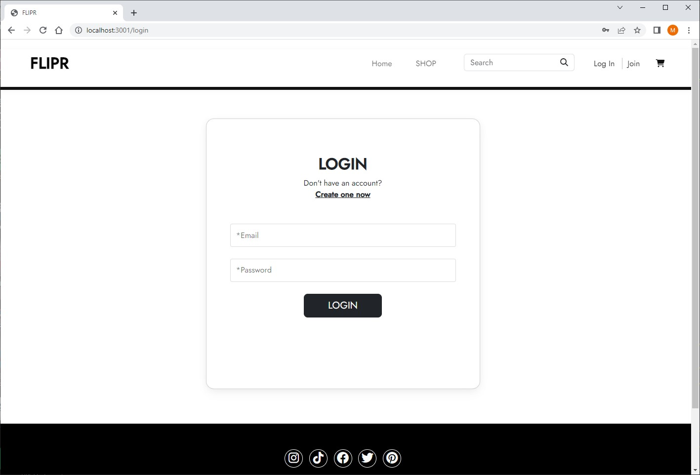
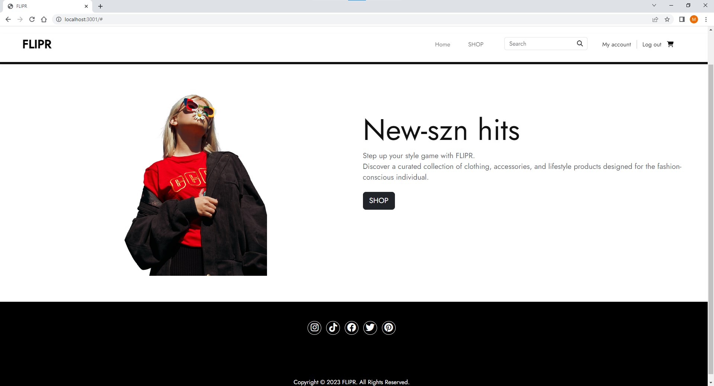
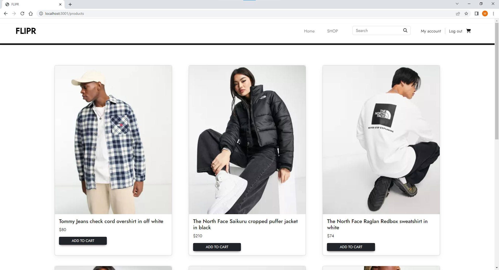
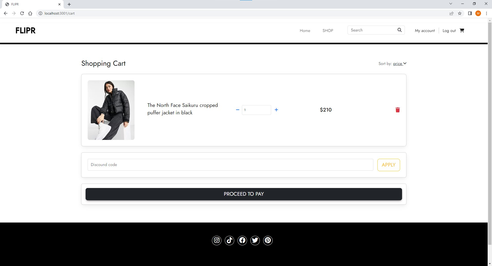

<h1 align="center">FLIPR</h1>

    
    
    
    

## Description 💾
FLIPR is a web application created using sequelize and express js. It is a demonstration of an e-commerce website for clothing brands. We use `express-sessions` to authenticate each users to store data and handlebars to display different web application pages. 

## User Story ✉️
~~~
AS an online shopper, 
I want to be able to sign up and log in to store my information
VIEW desired items on cart at any given time
PROTECT and MANAGE information for future purchases
THEN be able to complete the checkout process more efficiently. 
~~~
## Acceptance Criteria 📩
~~~
GIVEN join and login and my account page
WHEN I sign up I can then login
THEN I can view my name and email address
GIVEN a search bar,
WHEN I type in a keyword,
THEN search results that involves the keyword filters through the products
GIVEN an add to cart button,
WHEN I click 'add to cart', the product is added to my personal account cart,
THEN I can view products added in my cart 
~~~
## Table of Contents 🔍
* [Installation](#installation-)
* [Usage](#usage-)
* [Questions](#questions-)
* [License](#license)
* [Contributors](#contributors)

## Installation 🔨
To use this application direct to the git repo, git clone the repo down to your local.

Run `npm install` or `npm i` in order to install the following npm package,

* [`express`](https://www.npmjs.com/package/express)
* [`bcrypt`](https://www.npmjs.com/package/bcrypt)
* [`connect-session-sequelize`](https://www.npmjs.com/package/connect-session-sequelize)
* [`dotenv`](https://www.npmjs.com/package/dotenv)
* [`express-handlebars`](https://www.npmjs.com/package/express-handlebars)
* [`express-session`](https://www.npmjs.com/package/express-sessions)
* [`mysql2`](https://www.npmjs.com/package/mysql2)
* [`sequelize`](https://www.npmjs.com/package/sequelize)

Direct to the db file and `source schema.sql`

Then run `npm run seed` to import existing database.

Finally, you can run `npm start` to run the application on `localhost:3001`

## Usage 💡
Application deployed on heroku: https://vast-thicket-59456.herokuapp.com/

First directory takes us to the login page, where you can register and login to access the application.

Next directory is our homepage with many different options such as, myaccount page, shop, or carts.

Then we can shop for products and add them to cart, or search for keywords.

Finally, we can view our added products in our cart.

## License
MIT License

## Contributors
- [Minjae Cho](https://github.com/slchld1)
- [Olivia Seonyeong Lee](https://github.com/oliviasylee)
- [Brandon Oroszco](https://github.com/Brandon42900)

## Questions ❓
For any Additional questions, Please reach out to: jaecho203@gmail.com, oliviasylee@gmail.com, Brandonorozco10@gmail.com or visit [slchld1](https://github.com/slchld1), [oliviasylee](https://github.com/oliviasylee), [Brandon42900](https://github.com/Brandon42900) on github! Thank you.